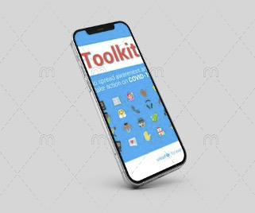

# COVID Toolkit README.md

#### Logo

#### Demo

**Screening for Covid-19**

**Quarantine Information**

**Vaccine eligibility**

## Table of Contents

1. Project description
2. Configuration Instructions
3. Installation Instructions
4. Operating Instructions
5. Manifest
6. Copyright information
7. Contact information
8. Bug list
9. Troubleshooting tips
10. Credits and acknowledgement
11. Links for further reading
12. Change log

## 1. Project description

We are excited to create an application that will work on two platforms that is Android as well as on iOS. In this application, we will provide the following features:

* Screening for Covid-19

  This section will allow the customer to answer some questions related to covid and help them understand if they are potentially exposed to Covid-19. If it turns to have some symptoms to the user, it will email the authorities for the next steps.

* Quarantine Information

  It will help the user get the essential requirement for self-isolation and tell the necessary measure that we need to take during the quarantine. It will also provide some government-authorized places which the user can use to quarantine. 

* Vaccine eligibility

  In this section, we help the user understand if the user satisfies the vaccinated requirements. 

### 2. Configuration Instructions

These instructions will help you load the source code in Android Studio.

1. Clone the following GitHub repoistory to a local path.
2. Setup Android Studio by following the instructions in this [video](https://www.youtube.com/watch?v=X-Z01L2IKlo).
3. Launch Android Studio and load the project from the local path specified above.

### 3. Installation Instructions

1. Go to Play Store on your Android phone.
2. Search for COVID Toolkit.
3. Tap the install button.

### 4. Operating Instructions

Once you download the application you will three options after the home page:

1. Covid screening: If you want to go for COVID screening just click on it and answer the following question. Just click on next to move forward and back arrow for moving to previous question. At last you will get a appropriate result.

2. Quarantine information: If you want quarantine information you should click on second option it comes up with three option in quarantine information. First general quarantine information which states the general information for covid. Second if you need info of how to quarantine just click on how to quarantine and scroll in downward direction. Third if you want to gather data about regional quarantine information just click on it and scroll down. If you want to back just click on back arrow.

3. Vaccine Information: Click on vaccine information for getting vaccine related data. Now we need to select the province for which we need to gather information and just click on that it pulls the link for vaccine related information for that province.

To quit just cancel survey.

### 5. Manifest

**activity_covid_screening.xml**

This is xml file for covid_screening activity. We have made use of linear layout. For height and width layout it matches parent layout . It’s orientation is in vertical format.

**activity_how_to_quarantine.xml**

This is xml file for How to quarantine activity. It also use linear layout and same for height and width it matches with parent layout. For text view we have made use of vertical scrollbars. 

**activity_introactivity.xml**

This is xml file for Introductory activity.

**activity_main.xml**

This is main xml file. It also use linear layout and same for height and width it matches with parent layout. We have created three buttons first button is for covid screening; second button is for quarantine information; third button is for vaccine eligibility.

**activity_quarantine_general_information.xml**

This is xml file for quarantine general information. It also use linear layout and same for height and width it matches with parent layout. We have made use of vertical scrollbars.

**activity_quarantine_information.xml**

This xml is for quarantine information. It makes use of linear layout and matches parent layout for width and height. It has three buttons one button is for Quarantine general information second is for how to quarantine and third is for regional quarantine information.

**activity_regional_quarantine_information.xml**

This xml file is for regional quarantine information. It makes use of linear layout.

**activity_vaccine_information.xml**

This xml file is for vaccine information activity.

**content_covid_screenig.xml**

Xml file for content of covid screening.

**fragment_first.xml**

Xml file for next button.

**fragment_second.xml**

Xml file for previous button. 

**CovidScreeningActivity.kt**

This activity for covid screening. It has multiple question which are used for screening for covid. For input it just takes only input from the client and if entered input matches the specification the user moves to next question and in this way if all the question are satisfied the user is good to go. If any of the question does not meets the requirements the user gets message that he cannot go.

**FirstFragment.kt**

This kotlin file is for next button that we use while covid screening. It has multiple functions.

**HowToQuarantineActivity.kt**

This kotlin has a class for how to quarantine. In this file we entered the html code for how to quarantine which displays the required information and updates it constantly.

**IntroActivity.kt**

This kotlin file is Introduction activity. We have created objected of val and passed main activity as a parameter.

**MainActivity.kt**

This is main activity. It is calling set.onclick listener on various button for operating its functionally. Val intent object is created and parameter are called as required. For example val intent object is created and covid screening activity is passed as parameter. It’s same for other two featured activity.

**QuarantineGeneralInformation.kt**

This kotlin file has a class forQuarantine general information . In this file we entered the html code for quarantine general information which displays the required information and updates it constantly.

**QuarantineInformation.kt**

It has class for quarantine information. For different buttons we create a object of val intent and pass different activites of inner function of quarantine information.

**RegionalQuarantineInformationActivity**

This kotlin has a class for reginalquarantine information . In this file we entered the html code for regional quarantine information which displays the required information and updates it constantly.

**SecondFragment**

This kotlin file is for previous button that we use while covid screening. It has multiple functions. 

**VaccineInformationActivity**

This kotlin has a class for vaccine information . In this file we entered the html code for vaccine information which displays the required information and updates it constantly.

### 6. Copyright information

Copyright 2021 Kunal Wadhwa

Permission is hereby granted, free of charge, to any person obtaining a copy of this software and associated documentation files (the "Software"), to deal in the Software without restriction, including without limitation the rights to use, copy, modify, merge, publish, distribute, sublicense, and/or sell copies of the Software, and to permit persons to whom the Software is furnished to do so, subject to the following conditions:

The above copyright notice and this permission notice shall be included in all copies or substantial portions of the Software.

THE SOFTWARE IS PROVIDED "AS IS", WITHOUT WARRANTY OF ANY KIND, EXPRESS OR IMPLIED, INCLUDING BUT NOT LIMITED TO THE WARRANTIES OF MERCHANTABILITY, FITNESS FOR A PARTICULAR PURPOSE AND NONINFRINGEMENT. IN NO EVENT SHALL THE AUTHORS OR COPYRIGHT HOLDERS BE LIABLE FOR ANY CLAIM, DAMAGES OR OTHER LIABILITY, WHETHER IN AN ACTION OF CONTRACT, TORT OR OTHERWISE, ARISING FROM, OUT OF OR IN CONNECTION WITH THE SOFTWARE OR THE USE OR OTHER DEALINGS IN THE SOFTWARE.

### 7. Contact information

Kunal Wadhwa, Email addres: kwadhwa@lakeheadu.ca

### 8. Bug list

None at the moment.

### 9. Troubleshooting tips

* [High-density displays](https://developer.android.com/studio/troubleshoot#high-density_displays)
* [Project sync issues](https://developer.android.com/studio/troubleshoot#project_sync_issues)
* [minSdkVersion issues](https://developer.android.com/studio/troubleshoot#minsdkversion_issues)
* [Emulator issues](https://developer.android.com/studio/run/emulator-troubleshooting)

### 10. Credits and acknowledgement

This project leverages the following libraries and SDKs:

* [SurveyKit: Create beautiful surveys on Android (inspired by ResearchKit Surveys on iOS)](https://github.com/quickbirdstudios/SurveyKit)
* [Kotlin Android](https://source.android.com/setup/build/downloading)
* [Kotlin Android Extensions](https://source.android.com/setup/build/downloading)
* [Android SDK](https://source.android.com/setup/build/downloading)

### 11.  Links for further reading

* [Android Development Resources](https://developer.android.com/)
* [SurveyKit Development Resources](https://github.com/quickbirdstudios/SurveyKit/blob/master/README.md)
* [Kotlin Android Extension Guide](https://developer.android.com/kotlin/ktx)
* [Learn Kotlin for Java developers](https://developer.android.com/kotlin/learn-kotlin-java-pathway)
* [Kotlin resources](https://developer.android.com/kotlin/kotlin-java-resources)

### 12. Change log

04/22/2021: Adding the README.md with relevant information.